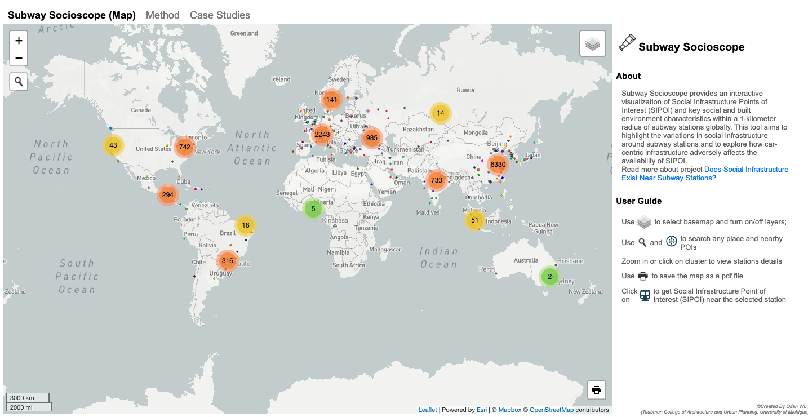

## Subway Socioscope - Where Does Social Infrastructure Exist Near Subway Stations?

[TAKE ME TO THE MANUSCRIPT](TBD).

[TAKE ME TO THE SUBWAY SOCIOSCOPE WEB TOOL](https://qifan-wu.github.io/testWebMap/).

### About The Project

Subway Socioscope provides an interactive visualization of Social Infrastructure Points of Interest (SIPOI) and key social and built environment characteristics within a 1-kilometer radius of subway stations globally. This tool aims to highlight the variations in social infrastructure around subway stations and to explore how car-centric infrastructure adversely affects the availability of SIPOI.

Read more about project here: [Where Does Social Infrastructure Exist Near Subway Stations? A Global Assessment Using OpenStreetMap Data](https://www.xiaofanliang.com/project/sipoi/).

### Data

#### Source (updated by June, 2024)
| Data          | Link/Source |
| ------------- | ------------- |
| **Metro Lines and Stations** | Data from [metrolinemap.com](https://www.metrolinemap.com/). Scraped and parsed by [Dénes Csala Data Consulting](https://github.com/denesdata/kontext/tree/master/metro)|
| **Social Infrastructure Point of Interest (SIPOI)** | Data From [OpenStreetMap](https://www.openstreetmap.org/). Retrieved with [Overpass API](https://overpass-api.de/) |
| **Built Environment Statistics (Building Area, Parking Area, Road Length)** | Data from [Ohsome API](https://docs.ohsome.org/ohsome-api/stable/endpoints.html)
| **Population Density** | Data from [WorldPop](https://www.worldpop.org/) For each subway station, we retrieved the four nearest 1 km grid and averaged the population.|
| **Distance To City Center** | First checked [Kaggle World Cities Datasets](https://www.kaggle.com/datasets/viswanathanc/world-cities-datasets/data). Then added the missing values with [GeoPy](https://geopy.readthedocs.io/en/stable/). |

#### SIPOI Catogory
| Category | OSM values|
| ------------- | ------------- |
| Public Institution | "social_facility", "schools", "college", "community_centre", etc.
| Commerce | "supermarket", "fashion", "grocery", "mall", etc. |
| Food & Drink| "restaurant", "cafe", "fast_food", "bar", "pub", etc. |
| Recreation | "park", "garden", "playground", "theatre", "clubhouse", etc. |
| Religion | "memorial", "monument", "cemetery", "heritage" |

#### Download Data in the Web Tool
* Metro Stations Info:  [stations_info.json](https://github.com/qifan-wu/testWebMap/blob/main/data/stations_info.json)
* TBD

### Tech Deck for Web Tool Implementation
| Type | API/Plugins|
| ------------- | ------------- |
| **Scriping Language** | * [Leaflet JS](https://leafletjs.com/): the main scripting language for web interaction
| **Data Fetching** | * [Leaflet.Overpasslayer](https://github.com/plepe/overpass-layer) for fetching and displaying SIPOI on the Map   * [Ohsome API](https://docs.ohsome.org/ohsome-api/stable/endpoints.html) for calculating built environment statistics near the selected station
| **UI Features** | * [Esri developer API ](https://developers.arcgis.com/api-keys/) for searchbox   * [Chart.js](https://www.chartjs.org/) for showing statistics plots   * [osmtogeojson](https://github.com/tyrasd/osmtogeojson) for downloading SIPOI as Geojson   * [Mapbox](https://www.mapbox.com/) for base map: street   * [Leaflet.markercluster](https://github.com/Leaflet/Leaflet.markercluster) for displaying metro stations in a cluster view   * [Leaflet.Legend](https://github.com/ptma/Leaflet.Legend) for showing SIPOI legend   * [Leaflet-easyPrint](https://github.com/rowanwins/leaflet-easyPrint) for printing map to PDF
| **Computation and Processing** | * **R** for calculating population density   * **Python** (`pandas`, `urbanaccess`) for calculating the metro stations information  

### Potential Q & A with the Web Tool

**TBD**.

TBD

Please email qifanw@umich.edu for questions.