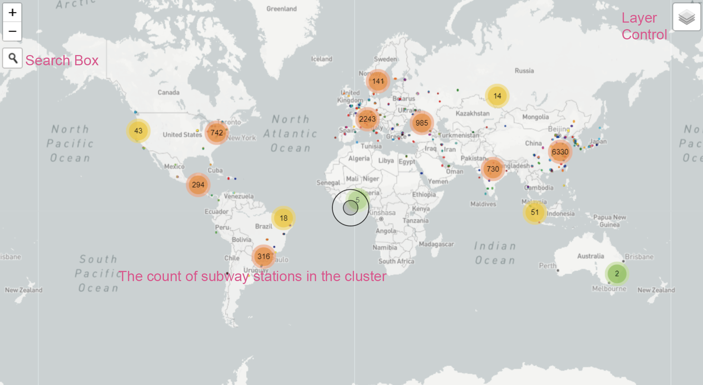
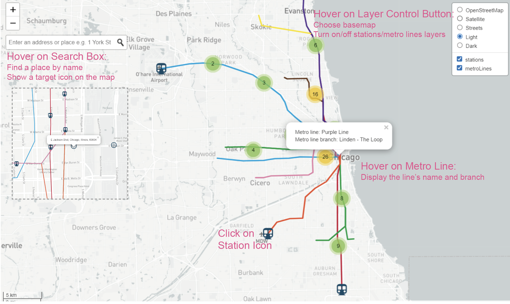
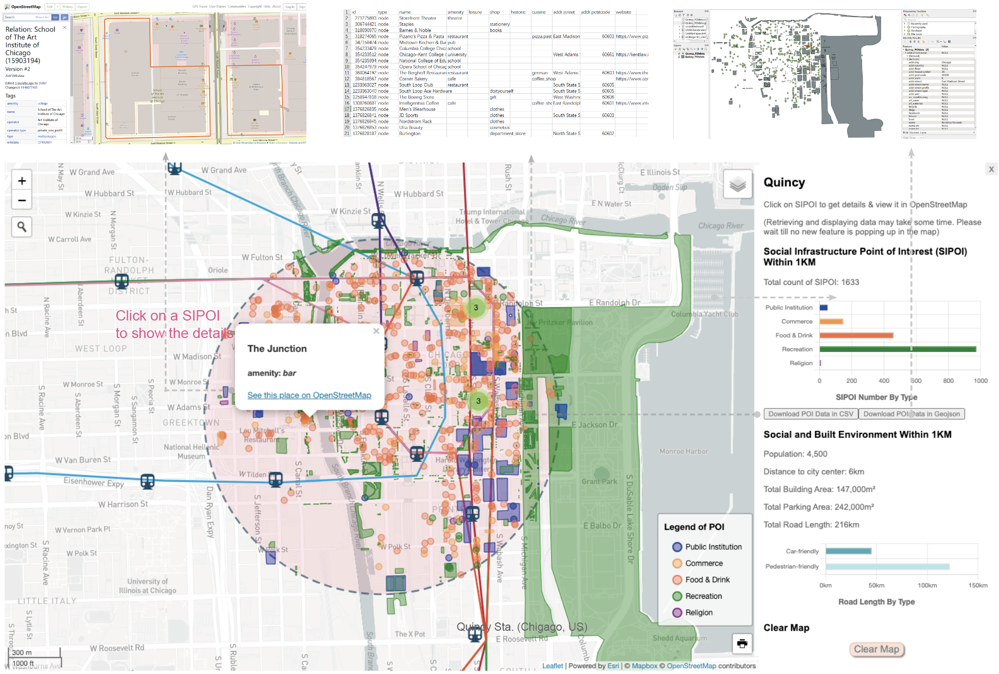

<!-- ## Subway Socioscope - Where Does Social Infrastructure Exist Near Subway Stations? -->

[TAKE ME TO THE MANUSCRIPT](TBD).

[TAKE ME TO THE SUBWAY SOCIOSCOPE WEB TOOL](https://qifan-wu.github.io/testWebMap/).

### About The Project

Subway Socioscope provides an interactive visualization of Social Infrastructure Points of Interest (SIPOI) and key social and built environment characteristics within a 1-kilometer radius of subway stations globally. This tool aims to highlight the variations in social infrastructure around subway stations and to explore how car-centric infrastructure adversely affects the availability of SIPOI.

Read more about project here: [Where Does Social Infrastructure Exist Near Subway Stations? A Global Assessment Using OpenStreetMap Data](https://www.xiaofanliang.com/project/sipoi/).

### User Guide
#### Default Page
This page displays all the metro stations worldwide in cluster view. The number in the circle represent the count of stations in that area.

#### Zoom In: City Level
Click on the cluster / Click on the "+" on the map to zoom in and display the metro stations with station icons. Hover on the station to see its name. Click on the metro line to show the line name, start and terminal.

#### Zoom In: Station Level
Click on the station icon to how the Social Infrastructure Point Of Interest (SIPOI) within 1km buffer from the station, by category. See the details of SIPOI statistics / Built environment information / Download SIPOI data in CSV/Geojson format / Clear map in the side panel.

### Data
Data used in the web tool is collected from open-source database including OSM.
#### Source (updated by June, 2024)
| Data          | Link/Source |
| ------------- | ------------- |
| **Metro Lines and Stations** | Data from [metrolinemap.com](https://www.metrolinemap.com/). Scraped and parsed by [Dénes Csala Data Consulting](https://github.com/denesdata/kontext/tree/master/metro)|
| **Social Infrastructure Point of Interest (SIPOI)** | Data From [OpenStreetMap](https://www.openstreetmap.org/). Retrieved with [Overpass API](https://overpass-api.de/) |
| **Built Environment Statistics (Building Area, Parking Area, Road Length)** | Data from [Ohsome API](https://docs.ohsome.org/ohsome-api/stable/endpoints.html)
| **Population Density** | Data from [WorldPop](https://www.worldpop.org/). For each subway station, we retrieved the four nearest 1 km grid and averaged the population.|
| **Distance To City Center** | First checked [Kaggle World Cities Datasets](https://www.kaggle.com/datasets/viswanathanc/world-cities-datasets/data). Then added the missing values with [GeoPy](https://geopy.readthedocs.io/en/stable/). |

#### Missing data?
* Missing metro line: This may be due to incomplete data from our source, [metrolinemap.com](https://www.metrolinemap.com/).
* Missing metro station: they are not available or are labeled as light rail stations in [OpenStreetMap](https://www.openstreetmap.org/)
* Missing social infrastructure: Map it in [OpenStreetMap](https://www.openstreetmap.org/) to help support an open-source database.

#### SIPOI Catogory
| Category | OSM values|
| ------------- | ------------- |
| Public Institution | "social_facility", "library", "arts_centre" "school", "university", "college", "social_centre", "community_centre", "conference_centre", "events_venue", "exhibition_centre", "coworking_space", "events_centre", "memorial", "monument", "cemetery", "heritage" |
| Commerce | "nightclub", "marketplace", "convenience", "supermarket", "clothes", "hairdresser", "car repair", "bakery", "beauty", "kiosk", "hardware", "alcohol", "florist", "electronics", "shoes", "variety store", "mall", "optician", "jewelry", "doityourself", "gift", "greengrocer", "books", "bicycle", "department store", "laundry", "sports", "pet", "stationery", "confectionery", "cosmetics", "tailor", "newsagent", "beverages", "tobacco", "garden_centre", "massage", "pastry", "deli", "ticket", "toys", "seafood", "houseware", "wine", "photo", "charity", "tattoo", "art", "outdoor", "second hand", "fabric", "antiques", "coffee", "craft", "tea", "baby_goods", "musical_instrument", "music", "motorcycle_repair", "dairy", "chocolate", "cheese", "pet_grooming", "health_food", "video_games", "fishing", "grocery", "nutrition_supplements", "fashion_accessories", "watches", "cannabis", "estate_agent", "sewing", "video", "erotic", "herbalist", "frozen_food", "party", "shoe_repair", "repair", "ice_cream", "games", "pottery", "fashion", "spices", "photo_studio", "candles", "water_sports", "pasta", "honey", "rice", "anime", "nuts", "trophy", "wool", "wigs", "psychic", "ski", "shopping_centre"|
| Food & Drink| "restaurant", "cafe", "fast_food", "bar", "pub", "ice_cream", "internet_cafe", "food_court", "biergarten", "canteen" |
| Recreation | "theatre", "cinema", "bbq", "public_bookcase", "casino", "dojo", "love_hotel", "kneipp_water_cure", "karaoke_box", "hookah_lounge", "stripclub", "clubhouse", "swingerclub", "public_bath", "lavoir", "kitchen", "social_club", "stage", "music_venue", "concert_hall", "festival_grounds" |
| Religion | "memorial", "monument", "cemetery", "heritage" |

#### Download Data in the Web Tool
* Metro Stations Info:  [stations_info.json](https://github.com/qifan-wu/testWebMap/blob/main/data/stations_info.json)
* TBD

### Tech Deck for Web Tool Implementation
| Type | API/Plugins|
| ------------- | ------------- |
| **Scriping Language** | * [Leaflet JS](https://leafletjs.com/): the main scripting language for web interaction
| **Data Fetching** | * [Leaflet.Overpasslayer](https://github.com/plepe/overpass-layer) for fetching and displaying SIPOI on the Map   * [Ohsome API](https://docs.ohsome.org/ohsome-api/stable/endpoints.html) for calculating built environment statistics near the selected station
| **UI Features** | * [Esri developer API ](https://developers.arcgis.com/api-keys/) for searchbox   * [Chart.js](https://www.chartjs.org/) for showing statistics plots   * [osmtogeojson](https://github.com/tyrasd/osmtogeojson) for downloading SIPOI as Geojson   * [Mapbox](https://www.mapbox.com/) for base map: street   * [Leaflet.markercluster](https://github.com/Leaflet/Leaflet.markercluster) for displaying metro stations in a cluster view   * [Leaflet.Legend](https://github.com/ptma/Leaflet.Legend) for showing SIPOI legend   * [Leaflet-easyPrint](https://github.com/rowanwins/leaflet-easyPrint) for printing map to PDF   * [showdownjs](https://github.com/showdownjs/showdown?tab=readme-ov-file) for README.md wrap to HTML
| **Computation and Processing** | * **R** for calculating population density   * **Python** (`pandas`, `urbanaccess`) for calculating the metro stations information  

### Case Studies Matching
We used genetic matching to evaluate the effect of car-oriented infrastructure while controlling for population density, building area, road length, and continent. We focused on car-oriented infrastructure because it implies design elements that urban planners can easily impact and change. Genetic matching was chosen because we observed nonlinear relationships between the variables in the scatterplots. In this matching analysis, “treatments” refer to stations that have a high ratio of caroriented roads or parking areas (i.e., over 80% percentile of all stations). “Controls” represent stations that have similar population density, building area, road length, and continents. Among the control variables, only continents were coded as ordinal variables while others

### Potential Q & A with the Web Tool

**TBD**.

TBD

Please email qifanw@umich.edu for questions.